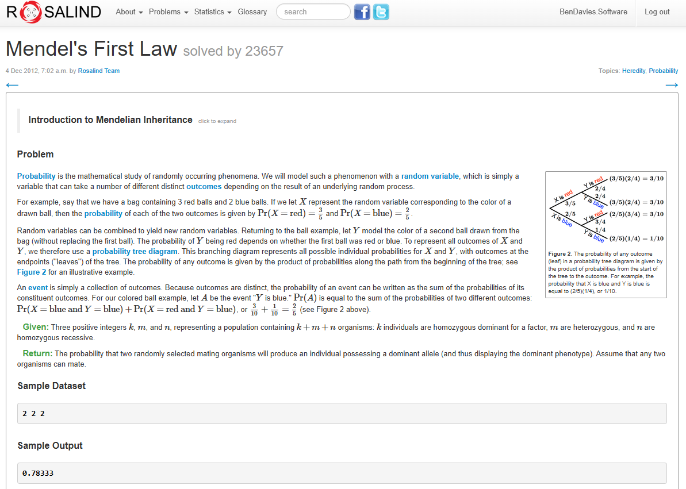
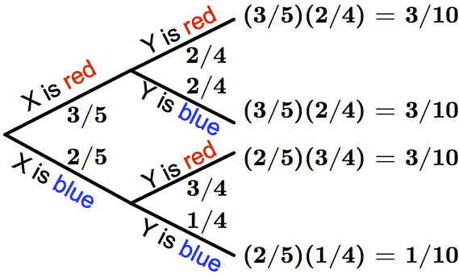
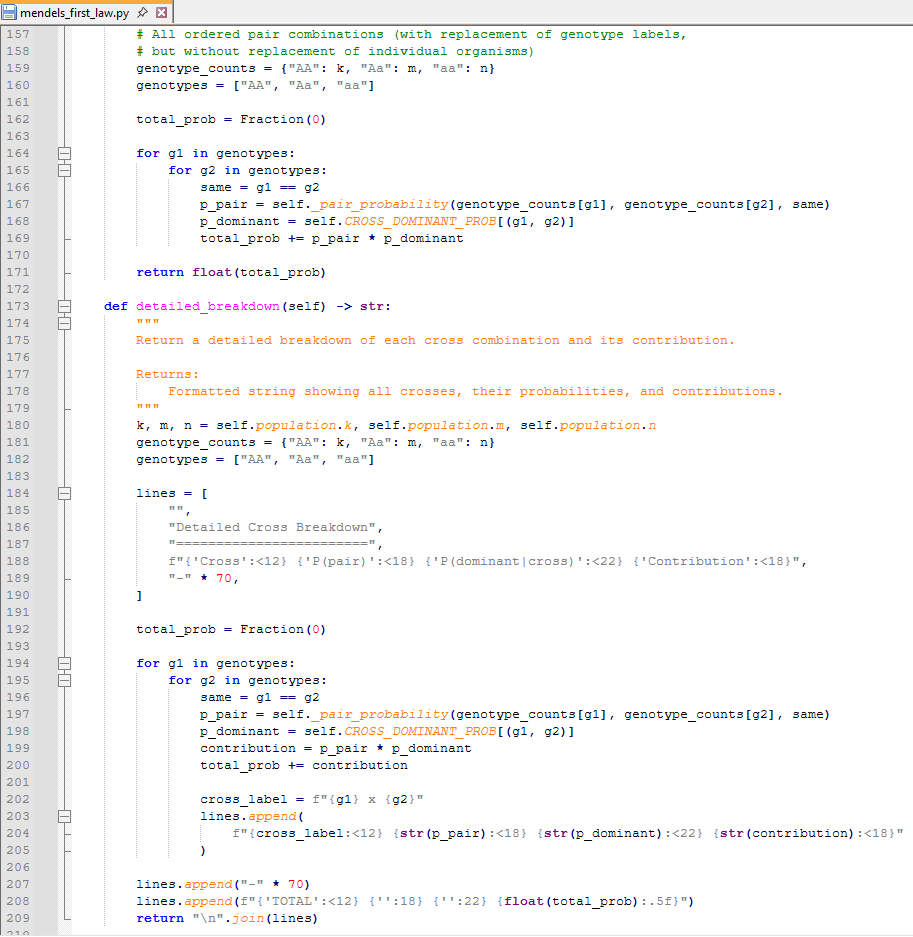

# Mendel's First Law Solver

Solution to the [Rosalind IPRB](https://rosalind.info/problems/iprb/) problem.

## Problem

Given a population of `k` homozygous dominant (AA), `m` heterozygous (Aa),
and `n` homozygous recessive (aa) organisms, calculates the probability that
two randomly selected mating organisms produce offspring with the dominant phenotype.



## Background

The solution is based on Mendelian inheritance and probability tree diagrams. For any two
randomly selected parent organisms, the probability of a dominant-phenotype offspring
depends on which genotypes are selected. All nine ordered parent-pair combinations are
considered, weighted by their probability of being drawn from the population without
replacement.



## Usage

```bash
# Interactive mode
python mendels_first_law.py

# Direct input (space-separated)
python mendels_first_law.py "2 2 2"

# Three separate arguments
python mendels_first_law.py 2 2 2
```

**Sample input:** `2 2 2`  
**Sample output:** `0.78333`

## Code Overview

The solver uses exact rational arithmetic (`fractions.Fraction`) to avoid floating-point
drift, iterating over all ordered genotype-pair combinations and accumulating the
probability of a dominant-phenotype offspring.



## Features

- Class-based design (`Population`, `MendelSolver`, `InputHandler`)
- Exact rational arithmetic using Python's `Fraction` class
- Full input validation with helpful error messages
- Detailed cross-by-cross breakdown output
- Works as a standalone script or importable module

## Classes

| Class | Responsibility |
|-------|---------------|
| `Population` | Stores and validates `k`, `m`, `n` counts |
| `MendelSolver` | Performs the probability calculation and produces a detailed breakdown |
| `InputHandler` | Handles user input (interactive console and string-parsing modes) |

## Topics

`python` `bioinformatics` `rosalind` `genetics` `probability`
